# Monitoring, Logging & Security — Full Observability Stack

## Overview

This lab solves a production problem: **how do you know when your application is broken, who changed what in your AWS account, and whether someone is attacking your infrastructure — all without logging into servers manually?**

A Node.js application running in Docker with no observability is a black box. You cannot answer: is it slow? is it throwing errors? is it even running? And when something goes wrong at 2am, you have no trail of what changed. This project addresses that by combining four tools:

- **Prometheus** scrapes metrics from the app and infrastructure every 15 seconds — request rate, error rate, latency, CPU, memory
- **Grafana** visualises those metrics in a live dashboard with pre-built alert rules
- **AWS CloudWatch** receives container logs streamed from the Docker `awslogs` driver — persistent, searchable, outside the container lifecycle
- **AWS CloudTrail** records every API call made in the account — who created what, when, from where
- **AWS GuardDuty** continuously analyses CloudTrail, VPC flow logs, and DNS logs for threats
- **Terraform** provisions the entire AWS infrastructure as code — reproducible, version-controlled, destroyable in one command
- **Ansible** configures the EC2 instance over SSH — installs Docker, Docker Compose, and Git without touching user_data scripts

The result is a fully observable, auditable system: metrics, logs, alerts, and security monitoring — all declared in code.

---

## Objectives

- Instrument a Node.js/Express API with Prometheus metrics (Counter, Histogram, default process metrics)
- Auto-provision Grafana datasource and dashboard — no manual UI setup required
- Define alert rules for high error rate, high latency, and app down
- Stream container logs to AWS CloudWatch via the Docker `awslogs` log driver
- Provision VPC, EC2, Elastic IP, IAM instance profile, CloudWatch, CloudTrail, and GuardDuty with Terraform modules
- Bootstrap remote state in S3 with DynamoDB locking before provisioning main infrastructure
- Configure EC2 over SSH with Ansible — idempotent, re-runnable, task-by-task output
- Auto-generate `ansible/inventory.ini` from Terraform output — no manual IP hardcoding
- Keep all credentials in `.env`, gitignored and never committed

---

## Tools & Versions

| Tool             | Version         |
|------------------|-----------------|
| Terraform        | >= 1.5.0        |
| AWS Provider     | ~> 5.0          |
| Ansible          | 2.x             |
| Docker           | 25.0.14         |
| Docker Compose   | v2.27.0         |
| Node.js          | 18-alpine       |
| Prometheus       | v2.51.0         |
| Grafana          | 10.4.0          |
| Node Exporter    | v1.7.0          |
| EC2 AMI          | Amazon Linux 2  |
| Instance Type    | t3.micro        |
| Region           | eu-west-1       |
| OS (local)       | macOS           |

---

## Problem This Lab Solves

Running a containerised application in production without observability leads to:

- **Invisible failures** — the app throws 500 errors for hours before anyone notices
- **No latency baseline** — you cannot tell if the app is slow today versus last week
- **Log loss** — container logs vanish when the container restarts or the EC2 is terminated
- **No audit trail** — you cannot answer "who changed the security group at 3am?"
- **Reactive security** — you only discover an intrusion after the damage is done
- **Manual server setup** — every new EC2 requires SSH steps to install Docker, and those steps are not reproducible

Prometheus + Grafana + CloudWatch + CloudTrail + GuardDuty + Terraform + Ansible eliminates all seven. The full system — infrastructure, server configuration, metrics, alerts, log routing, and security monitoring — is declared in version-controlled files.

---

## Architecture

```
YOUR MACHINE
│
├── Terraform ──→ provisions AWS infrastructure
│                 writes infra/ansible/inventory.ini with real EC2 IP
│
└── Ansible   ──→ SSHes into EC2, installs Docker + Compose + Git
                    ↓
                EC2 Instance (Amazon Linux 2, t3.micro + Elastic IP)
                IAM Instance Profile → allows CloudWatch log driver
                └── Docker Engine
                    └── Compose Project: monitoring-logging-security
                        ├── Service: app           (Node.js, port 3000)
                        │     └── exposes /metrics for Prometheus
                        ├── Service: prometheus    (port 9090)
                        │     ├── scrapes app:3000/metrics
                        │     ├── scrapes node-exporter:9100/metrics
                        │     └── evaluates alert_rules.yml
                        ├── Service: grafana       (port 3001)
                        │     ├── auto-provisioned Prometheus datasource
                        │     └── auto-provisioned app dashboard
                        └── Service: node-exporter (port 9100)
                              └── exposes host CPU, memory, disk metrics
                        │
                        awslogs driver
                        │
                        ▼
                AWS CloudWatch — /monitoring-lab/app log group

AWS Account (eu-west-1)
├── CloudTrail  → records all API calls → S3 bucket + CloudWatch log group
│                 encrypted (AES256), versioned, lifecycle to Glacier
└── GuardDuty   → analyses CloudTrail + VPC flow logs + DNS for threats
```

---

## Project Structure

```
monitoring-logging-security/
├── app/
│   ├── src/
│   │   ├── app.js               # Express app with metrics middleware and routes
│   │   └── metrics.js           # prom-client registry — Counter + Histogram + defaults
│   ├── tests/
│   │   ├── app.test.js          # Route integration tests
│   │   └── metrics.test.js      # /metrics format, presence, counter behaviour
│   ├── Dockerfile               # Multi-stage build, non-root user (appuser)
│   └── package.json
├── prometheus/
│   ├── prometheus.yml           # Scrape config — app, node-exporter, prometheus
│   └── alert_rules.yml          # HighErrorRate (>5%), HighLatency (p95>500ms), AppDown
├── grafana/
│   ├── provisioning/
│   │   └── datasources/
│   │       └── prometheus.yml   # Auto-provisioned Prometheus datasource with uid
│   └── dashboards/
│       ├── dashboard.yml        # Dashboard provisioner config
│       └── app-dashboard.json   # Traffic overview, request metrics, latency, system
├── docker-compose.yml           # Local stack — json-file logging
├── docker-compose.cloudwatch.yml # Override — switches app to awslogs driver
├── .env.example                 # Credential template — copy to .env
├── .gitignore
└── infra/
    ├── backend/                 # Stage 1 — S3 + DynamoDB bootstrap (local state)
    │   ├── main.tf
    │   ├── variables.tf
    │   └── outputs.tf
    ├── ansible/
    │   ├── playbook.yml         # Installs Docker, Compose v2.27.0, Git on EC2
    │   └── inventory.ini        # Auto-generated by Terraform after apply (gitignored)
    ├── modules/
    │   ├── networking/          # VPC, subnet, IGW, route table, security group
    │   ├── compute/             # EC2, key pair, Elastic IP, IAM instance profile
    │   ├── cloudwatch/          # /monitoring-lab/app log group + EC2 CPU alarm
    │   ├── cloudtrail/          # Trail, S3 bucket, encryption, lifecycle, IAM role
    │   └── guardduty/           # GuardDuty detector (data source — lab SCP safe)
    ├── main.tf                  # Root — providers, modules, inventory.ini generation
    ├── variables.tf
    └── outputs.tf
```

---

## Prerequisites

1. Terraform >= 1.5.0
2. Ansible installed locally
3. AWS CLI configured (`aws configure`) with region `eu-west-1`
4. Docker + Docker Compose v2
5. Node.js >= 18
6. An SSH key at `~/.ssh/monitoring` — generated in Step 0 below

---

## Usage

### Step 0 — Generate Your SSH Key

```bash
ssh-keygen -t ed25519 -f ~/.ssh/monitoring -N ""
```

Creates two files:

- `~/.ssh/monitoring` — private key, stays on your machine, never committed
- `~/.ssh/monitoring.pub` — public key, Terraform uploads this to AWS as a key pair

EC2 instances don't have passwords — AWS uses key pairs. Ansible also uses this key to SSH in and configure the server. The `-N ""` flag sets no passphrase so Ansible can connect non-interactively.

---

### Step 1 — Run Tests Locally

```bash
cd app
npm install
npm test
```

14 tests across two suites — route integration and metrics behaviour:

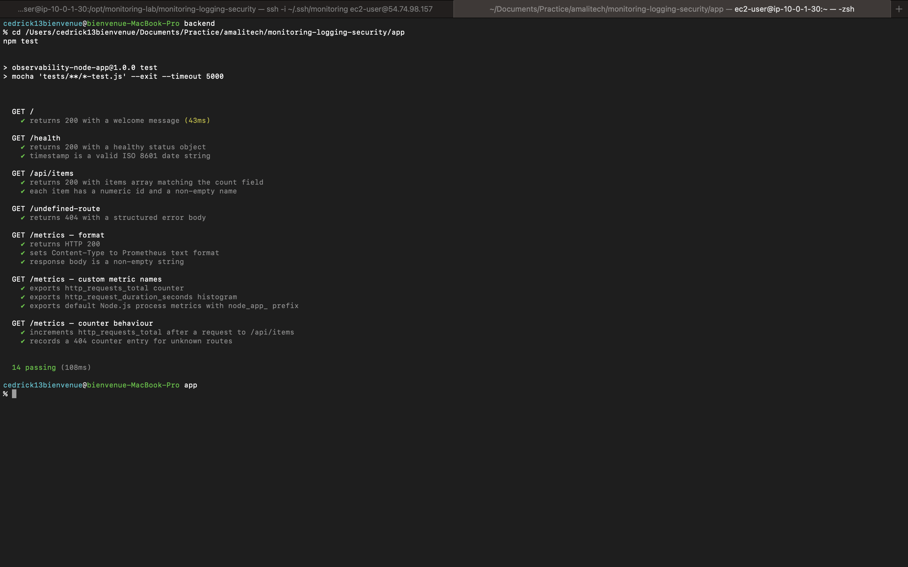

---

### Step 2 — Run the Local Observability Stack

```bash
cd ..
cp .env.example .env
docker compose up -d
docker compose ps
```

Builds the Node.js image and starts all four services. The app container must be healthy before Prometheus and Grafana start.

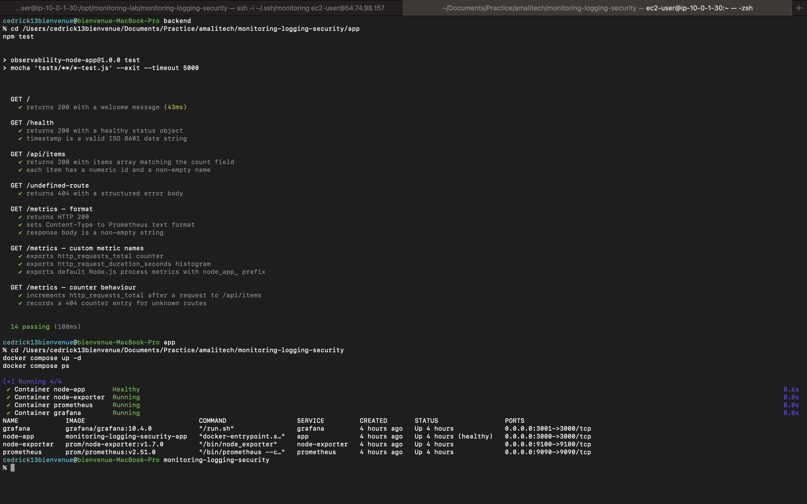

Generate traffic so the dashboard has data:

```bash
for i in {1..20}; do curl -s http://localhost:3000 > /dev/null; done
```

**Prometheus targets** — all three scrape jobs reporting UP:

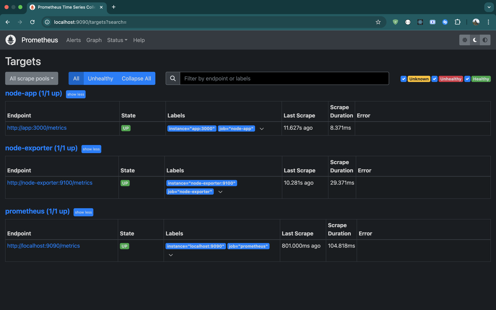

**Grafana dashboard** — open [http://localhost:3001](http://localhost:3001) (admin / admin123):

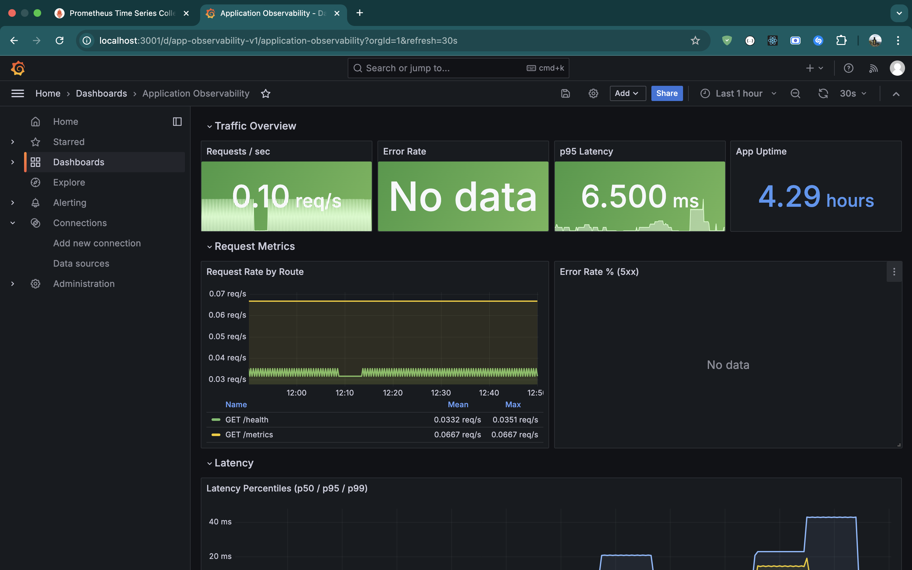

**Raw metrics endpoint** — Prometheus text format at [http://localhost:3000/metrics](http://localhost:3000/metrics):

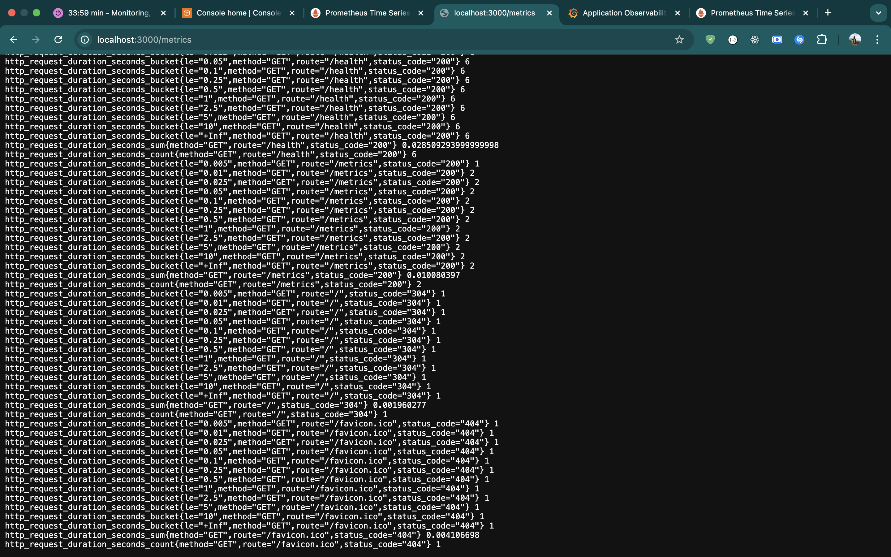

**Alert rules** — three rules loaded, all inactive while the app is healthy:

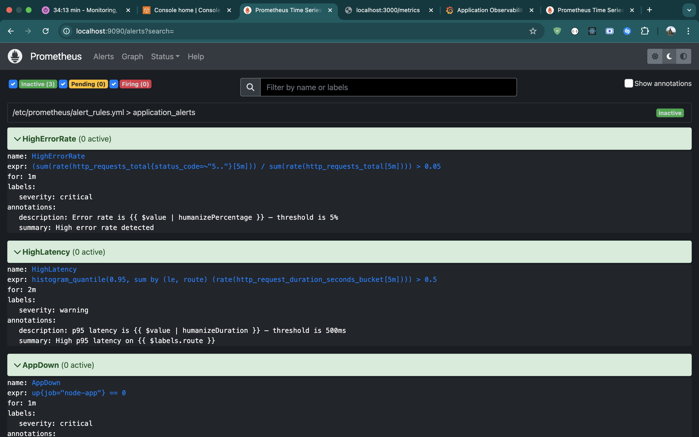

Stop the app container to trigger the `AppDown` alert:

```bash
docker stop node-app
```

Wait 1 minute — the alert fires:

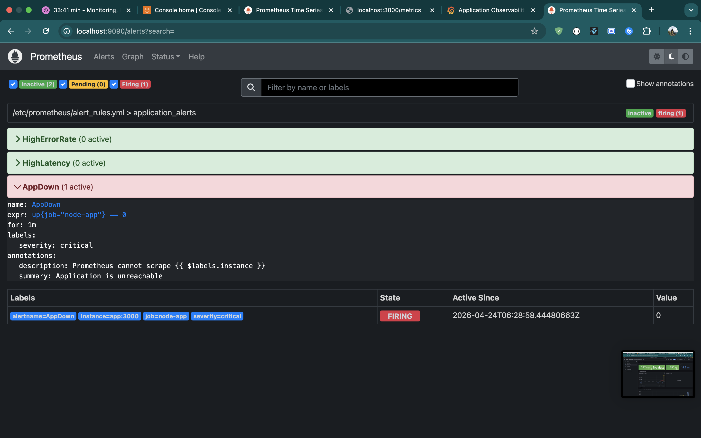

Restart it:

```bash
docker start node-app
```

```bash
docker compose down
```

---

### Stage 1 — Bootstrap the Remote Backend

```bash
cd infra/backend
terraform init
terraform apply
```

Type `yes`. Creates two AWS resources in eu-west-1:

| Resource | Purpose |
|---|---|
| S3 bucket `cedrick-monitoring-lab-state` | Stores `terraform.tfstate` remotely |
| DynamoDB table `monitoring-lab-lock` | Locks state during apply — prevents corruption |

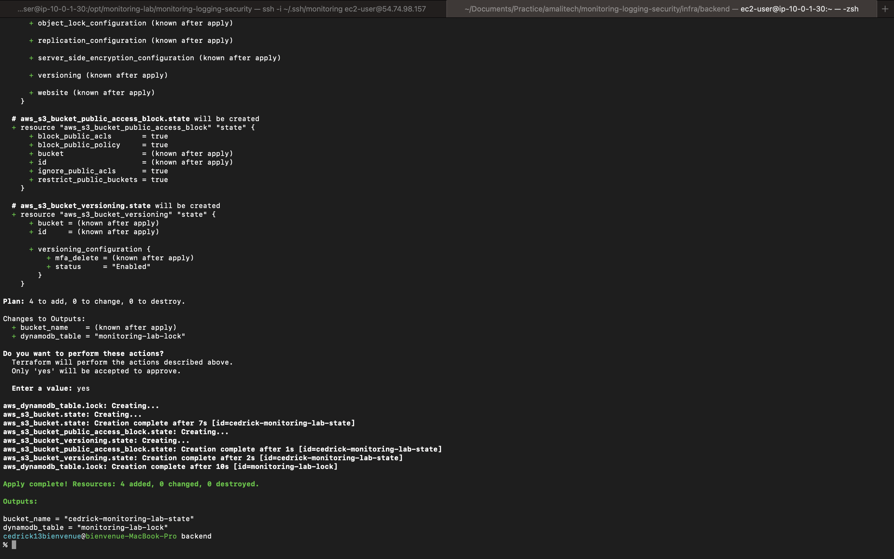

---

### Stage 2 — Provision AWS Infrastructure

```bash
cd ../
terraform init
terraform apply
```

Type `yes`. Your public IP is auto-detected from `https://checkip.amazonaws.com` — no manual input required. Terraform creates:

| Resource | Purpose |
|---|---|
| VPC | Isolated private network in eu-west-1 |
| Public Subnet | eu-west-1a — where EC2 lives |
| Internet Gateway | Routes traffic between VPC and internet |
| Security Group | SSH (22) from your IP only; app (3000), Prometheus (9090), Grafana (3001), node-exporter (9100) open |
| Key Pair | Uploads `~/.ssh/monitoring.pub` to AWS |
| EC2 Instance | Amazon Linux 2, t3.micro |
| Elastic IP | Static public IP — survives instance stops |
| IAM Instance Profile | Grants EC2 permission to write to CloudWatch Logs |
| CloudWatch Log Group | `/monitoring-lab/app` — receives container logs |
| CloudWatch Alarm | Fires when EC2 CPU > 80% for 2 periods |
| CloudTrail Trail | Multi-region, log file validation, streamed to S3 + CloudWatch |
| S3 Bucket | Stores CloudTrail logs — encrypted, versioned, lifecycle to Glacier |
| GuardDuty Detector | References existing detector (lab SCP restriction) |
| `ansible/inventory.ini` | Written automatically with the real EC2 IP |

At the end you'll see:

```
Apply complete! Resources: 32 added, 0 changed, 0 destroyed.

Outputs:
monitoring_server_ip = "x.x.x.x"
grafana_url          = "http://x.x.x.x:3001"
prometheus_url       = "http://x.x.x.x:9090"
```

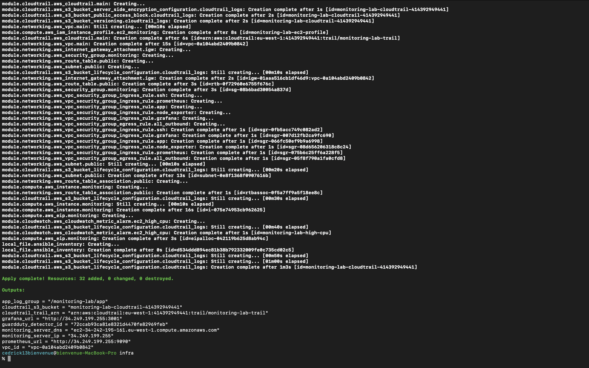

---

### Stage 3 — Configure EC2 with Ansible

Wait ~30 seconds for EC2 to finish booting, then:

```bash
ansible-playbook -i ansible/inventory.ini ansible/playbook.yml
```

Ansible SSHes into the EC2 using `~/.ssh/monitoring` and runs these tasks in order:

| Task | What happens |
|---|---|
| Update all packages | `yum update -y` — patches the OS |
| Install Docker and Git | `yum install -y docker git` — idempotent, skipped if already installed |
| Enable and start Docker | Starts now + auto-starts on reboot via systemd |
| Add ec2-user to docker group | No `sudo` needed for docker commands |
| Create CLI plugins directory | Where Compose binary will live |
| Install Docker Compose v2.27.0 | Downloaded directly from GitHub releases |
| Symlink docker-compose | Makes both `docker compose` and `docker-compose` work |
| Create monitoring lab directory | `/opt/monitoring-lab` owned by ec2-user |
| Verify Docker version | Smoke test — prints installed version |
| Verify Compose version | Smoke test — prints installed version |

The final line should show `failed=0`:

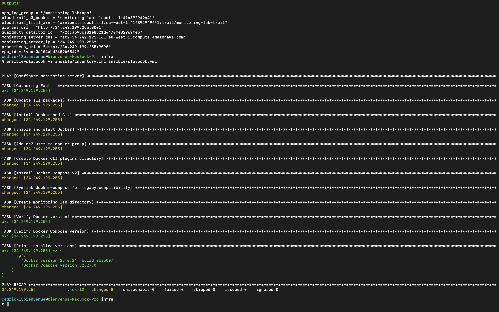

---

### Stage 4 — Deploy the Stack on EC2

SSH into the instance using the IP from Terraform output:

```bash
ssh -i ~/.ssh/monitoring ec2-user@$(terraform output -raw monitoring_server_ip)
```

Clone the repo and start the stack:

```bash
cd /opt/monitoring-lab
git clone https://github.com/cedrick13bienvenue/monitoring-logging-security .
cp .env.example .env
nano .env
```

Set `AWS_REGION=eu-west-1` — the EC2 IAM instance profile handles authentication for CloudWatch, no access keys needed in the env file.

Start the stack with the CloudWatch logging override:

```bash
docker compose -f docker-compose.yml -f docker-compose.cloudwatch.yml up -d
docker compose ps
```

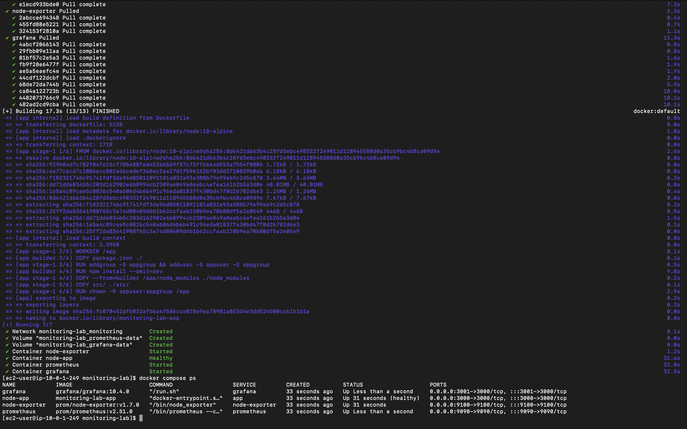

All four containers running. The app container uses the `awslogs` driver — logs stream directly to the `/monitoring-lab/app` CloudWatch log group.

Generate traffic:

```bash
for i in {1..20}; do curl -s http://localhost:3000 > /dev/null; done
```

**Prometheus targets on EC2** — all three scrape jobs UP:

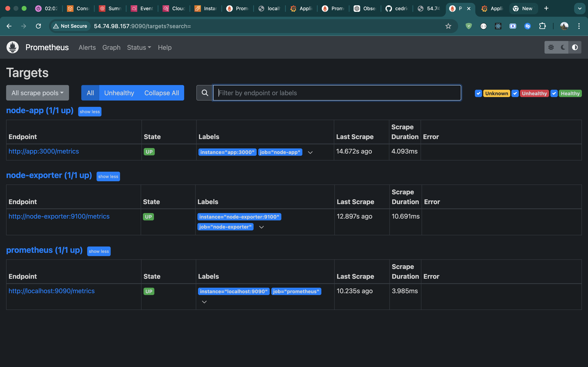

**Grafana dashboard on EC2:**

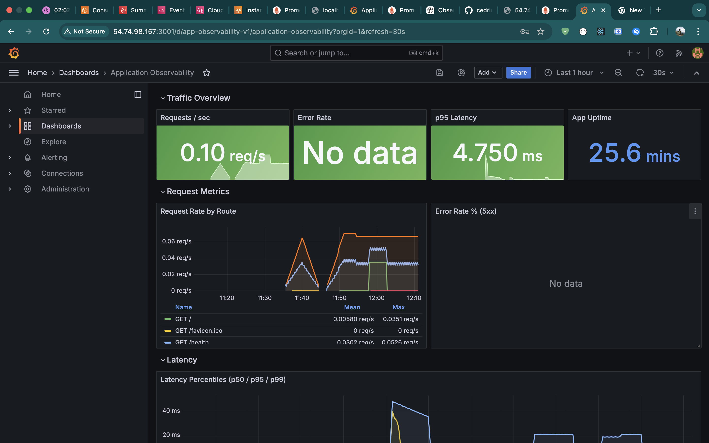

---

### Stage 5 — AWS Security Services

**CloudTrail** — every API call recorded: EC2 launch, security group changes, IAM operations, your console login:

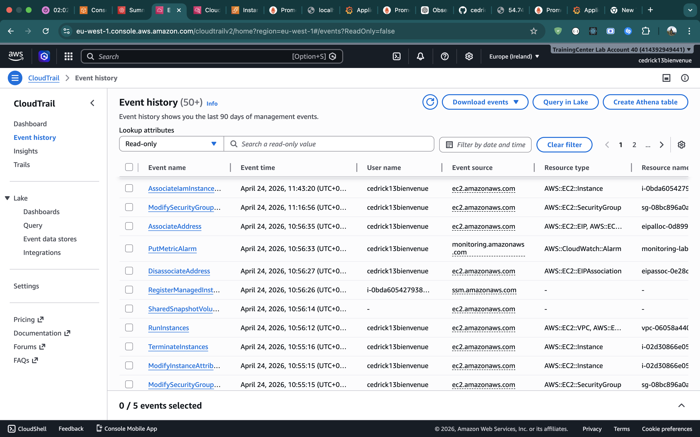

**GuardDuty** — threat detection active, 0 findings — no threats detected:

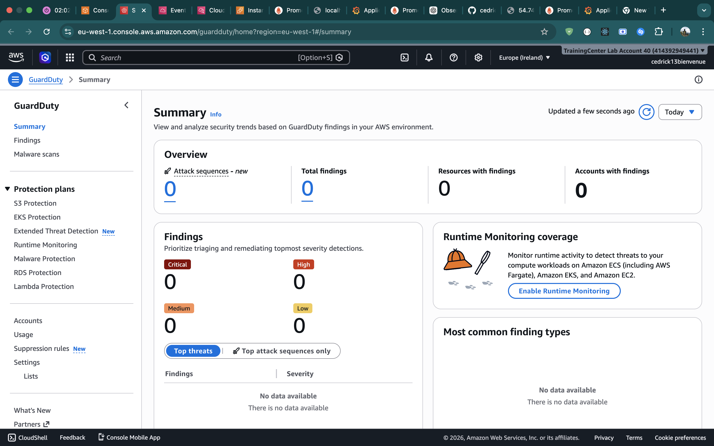

**CloudWatch Logs** — app container logs stream to `/monitoring-lab/app` log group via the `awslogs` Docker driver. Logs persist outside the container lifecycle — survives restarts and instance termination.

---

### Stage 6 — Teardown

```bash
# Destroy main infrastructure
cd infra
terraform destroy
```

Type `yes`. Destroys EC2, VPC, CloudTrail, CloudWatch, IAM resources. AWS billing stops.

```bash
# Destroy the backend last
cd backend
terraform destroy
```

> **Order matters** — always destroy main infra before the backend. Destroying the backend first removes the state file and Terraform loses track of what to delete.

> **GuardDuty** — managed as a data source. Not created or destroyed by Terraform due to a lab SCP restriction that blocks `guardduty:DeleteDetector`.

---

## Resources Deployed

| Resource | Name | Details |
|---|---|---|
| VPC | monitoring-lab-vpc | CIDR: 10.0.0.0/16 |
| Public Subnet | monitoring-lab-public-subnet | CIDR: 10.0.1.0/24, eu-west-1a |
| Internet Gateway | monitoring-lab-igw | Attached to VPC |
| Security Group | monitoring-lab-monitoring-sg | SSH (/32), app ports open |
| Key Pair | monitoring-lab-key | Ed25519, `~/.ssh/monitoring.pub` |
| EC2 Instance | monitoring-lab-monitoring-server | t3.micro, Amazon Linux 2 |
| Elastic IP | monitoring-lab-eip | Static IP, survives stops |
| IAM Role | monitoring-lab-ec2-role | Allows CloudWatch log writes |
| CloudWatch Log Group | /monitoring-lab/app | 30-day retention |
| CloudWatch Alarm | monitoring-lab-high-cpu | CPU > 80% for 2 periods |
| CloudTrail Trail | monitoring-lab-trail | Multi-region, validated |
| S3 Bucket | monitoring-lab-cloudtrail-{account-id} | Encrypted, versioned |
| GuardDuty Detector | (existing) | Referenced via data source |

---

## Remote Backend

| Component | Name | Purpose |
|---|---|---|
| S3 Bucket | cedrick-monitoring-lab-state | Stores terraform.tfstate |
| DynamoDB Table | monitoring-lab-lock | State locking |

State file path in S3: `monitoring-lab/terraform.tfstate`

---

## Key Design Decisions

**Ansible over user_data** — `user_data` runs blind: no live output, cannot be re-run, cannot tell which step failed. Ansible gives task-by-task output, idempotency, and can be re-run at any time against any instance. The `local_file` resource writes `inventory.ini` with the real EC2 IP after `terraform apply` — no manual copy-pasting of IPs between tools.

**IAM instance profile for CloudWatch** — the Docker `awslogs` log driver authenticates using the EC2 instance profile, not access keys. No AWS credentials in `.env` or environment variables. The profile grants only `logs:CreateLogGroup`, `logs:CreateLogStream`, `logs:PutLogEvents`, and `logs:DescribeLogStreams` — least privilege.

**Auto-detected public IP** — the `hashicorp/http` provider fetches the caller's IP from `checkip.amazonaws.com` at apply time. The security group SSH rule updates automatically on every `terraform apply` — no prompt, no hardcoded IP variable.

**Grafana auto-provisioning** — datasource and dashboard are provisioned via file-based provisioners. No manual UI setup. The datasource `uid: prometheus` matches the reference in the dashboard JSON — panels load on first boot.

**Docker Compose override pattern** — `docker-compose.yml` uses `json-file` logging for local development. `docker-compose.cloudwatch.yml` overrides only the app service logging driver. The same codebase runs locally and in AWS without modification.

**CloudTrail S3 lifecycle** — logs transition to STANDARD_IA after 30 days, GLACIER after 90 days, and expire after 365 days. Balances audit retention requirements against storage cost.

**GuardDuty as data source** — the lab account SCP blocks `guardduty:DeleteDetector`. Terraform manages GuardDuty as a `data` source rather than a `resource` — it reads the existing detector without trying to create or delete it. Future `terraform destroy` runs cleanly without hitting the SCP.

**Non-root container user** — the Node.js image creates a system user `appuser` and drops privileges before the process starts. If the container is compromised, the attacker has no root access to the host filesystem.
